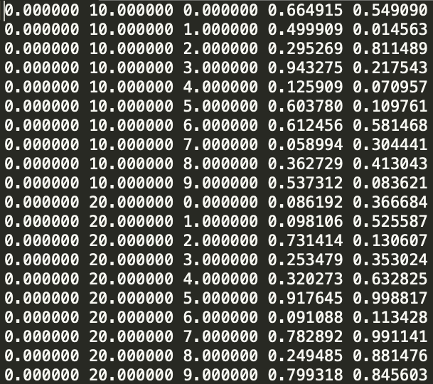

# Repeated value table interpolation

This script performs linear interpolation of tables with repeated values.

An example of a snippet of a table with repeated values is shown below (taken from [file.csv](file.csv)).
The first three columns are independent variables that repeat and the last two columns are dependent variables (that are 
to be interpolated).

## Project goal
The aim of this project is to create a script that can interpolate tables with repeated values. I believe this script 
will be a useful addition to the SciPy interpolation module, and I am working on its approval to the module.

Such tables are very common in aerospace engineering. For example, a drag polar typically details the drag coefficient 
at every Mach, height and lift coefficient. In this example the drag coefficient is the dependent variable (to be interpolated)
and the Mach, height and lift coefficient are the independent variables.

Interpolating tables with repeated values by hand is time consuming as the number of calculations increases exponentially with the number 
of columns of independent variables. The number of calculations is equal to `n_DV * sum([2**i for i in range(1, n_IV+1)])`,
 where `n_IV` is the number of independent variables and `n_DV` is the number of dependent variables. 
 
 In the [table above](example_table.png) there are three columns of independent variables and two dependent variables. 
 Therefore, the number of calculations required to find the interpolated values of both dependent variables = 
 `2 * sum([2**i for i in range(1, 3+1)]) = 28`. 

## Capabilities
- script can handle any table with repeated values
- interpolate along any number of independent and dependent variables
- Manipulation of independent and dependent variables controlled by the `move_columns` argument. 
This argument moves the selected columns to the far right of the table, which is where the dependent variables are.

## Examples 

Using the [table above](example_table.png) find the interpolated values of the dependent variables (the last two columns)
at the given points:

| input                                                 | points            | interpolated output       |
| ----------------------------------------------------- | ----------------- |:-------------------------:|
| `interpolate_table(out, 0, 10, 0.5)`                  | `(0, 10, 0.5)`    | `[0.582412, 0.2818265]`   |
| `interpolate_table(out, 0, 10, 0.5, move_columns=3)`  | `(0, 10, 0.5)`    | `[0.2818265, 0.582412]`   |
| `interpolate_table(out, 0, 15, 0.5)`                  | `(0, 15, 0.5)`    | `[0.3372805, 0.363981]`   |

Note that out is the table from [file.csv](file.csv): `out = np.loadtxt('file.csv')`